## Part 1
-  For this project We need first to make sure we have the next packages installed on our system `minikube kubectl docker`
- Next we need to run the next commands to setup the env `minikube start --memory=4096 \ kubectl cluster-info ` and then `kubectl apply -f /src/example` to get the next output: 
```
deployment.apps/apache created
deployment.apps/catalog created
deployment.apps/customer created
deployment.apps/order created
service/apache created
service/catalog created
service/customer created
service/order created
```
- Then we can check if everything is running 
- 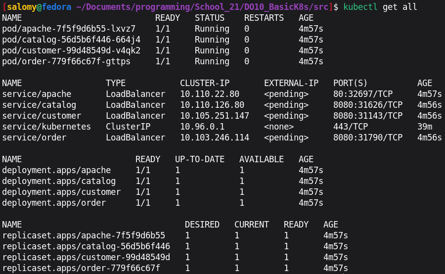

- To see everything from a dashboard web based we can run the next command in new terminal `minikube dashboard`
- 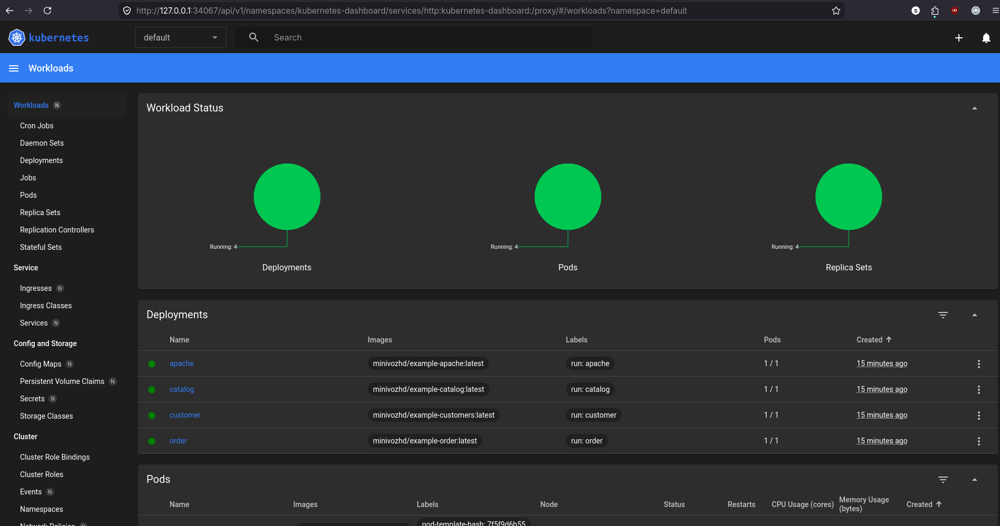

- Now to check the apache we can run `minikube service apache`
- 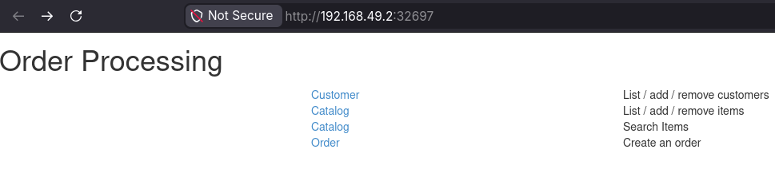

## Part 2
-  Modify application.properties files replace the hardcoded keys with `privateKey=${JWT_PRIVATE_KEY_VALUE}` and `publicKey=${JWT_PUBLIC_KEY_VALUE}`
- And also the UUID `gateway-service.uuid=${GATEWAY_SERVICE_UUID}` & `booking-service.uuid=${BOOKING_SERVICE_UUID}`
- After that I start minikube with command `minikube start --memory=6144 --cpus=2` and then in current terminal I run also `eval $(minikube docker-env)`

- Next I start to build the all 7 images with command 
```
for svc in session-service hotel-service booking-service payment-service loyalty-service report-service gateway-service; do
  echo "Building $svc..."
  docker build -t ${svc}:v1 ./${svc}
done
```
- 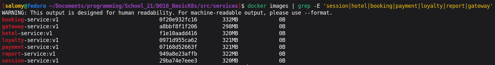

- Because we used variables for sensitive info now we need to create a Secret using command:
```
kubectl create secret generic app-secrets \
  --from-literal=POSTGRES_USER=<REDACTED> \
  --from-literal=POSTGRES_PASSWORD=<REDACTED> \
  --from-literal=RABBIT_MQ_USER=<REDACTED> \
  --from-literal=RABBIT_MQ_PASSWORD=<REDACTED> \
  --from-literal=GATEWAY_SERVICE_UUID=<REDACTED-UUID> \
  --from-literal=BOOKING_SERVICE_UUID=<REDACTED-UUID> \
  --from-file=JWT_PRIVATE_KEY_VALUE=./01/tmp/private.txt \
  --from-file=JWT_PUBLIC_KEY_VALUE=./01/tmp/public.txt \
  --dry-run=client -o yaml > ./01/k8s-manifests/01-secret.yaml
```
- For the next phase I created a folder with name k8s-manifests and I created 12 files with the first file `00-configmap.yaml` 
```
apiVersion: v1
kind: ConfigMap
metadata:
  name: app-config
data:
  POSTGRES_HOST: "postgres"
  POSTGRES_PORT: "5432"
  RABBIT_MQ_HOST: "rabbitmq"
  RABBIT_MQ_PORT: "5672"
  RABBIT_MQ_QUEUE_NAME: "reportQueue"
  RABBIT_MQ_EXCHANGE: "reportExchange"
  SESSION_SERVICE_HOST: "session-service"
  SESSION_SERVICE_PORT: "8081"
  HOTEL_SERVICE_HOST: "hotel-service"
  HOTEL_SERVICE_PORT: "8082"
  BOOKING_SERVICE_HOST: "booking-service"
  BOOKING_SERVICE_PORT: "8083"
  PAYMENT_SERVICE_HOST: "payment-service"
  PAYMENT_SERVICE_PORT: "8084"
  LOYALTY_SERVICE_HOST: "loyalty-service"
  LOYALTY_SERVICE_PORT: "8085"
  REPORT_SERVICE_HOST: "report-service"
  REPORT_SERVICE_PORT: "8086"
```
- The next step is to encode the JWT keys. The keys in application.properties with command 
```
awk '/^privateKey=/{flag=1; sub(/^privateKey=/,""); print; next}
     /^publicKey=/{flag=0}
     flag' "$ORIG" | tr -d '\\\n ' > ./01/tmp/private.txt

awk '/^publicKey=/{flag=1; sub(/^publicKey=/,""); print; next}
     flag' "$ORIG" | tr -d '\\\n ' > ./01/tmp/public.txt
```

- Then generate the Secret via kubectl:
```
kubectl create secret generic app-secrets \
  --from-literal=POSTGRES_USER=<REDACTED> \
  --from-literal=POSTGRES_PASSWORD=<REDACTED> \
  --from-literal=RABBIT_MQ_USER=<REDACTED> \
  --from-literal=RABBIT_MQ_PASSWORD=<REDACTED> \
  --from-literal=GATEWAY_SERVICE_UUID=<REDACTED-UUID> \
  --from-literal=BOOKING_SERVICE_UUID=<REDACTED-UUID> \
  --from-file=JWT_PRIVATE_KEY_VALUE=./01/tmp/private.txt \
  --from-file=JWT_PUBLIC_KEY_VALUE=./01/tmp/public.txt \
  --dry-run=client -o yaml > ./01/k8s-manifests/01-secret.yaml
```
  
- For postgres init simply we can create the mainfest file like this `02-postgres-init-cm.yaml`:
```
apiVersion: v1
kind: ConfigMap
metadata:
  name: postgres-init
data:
  init.sql: |
    DROP DATABASE IF EXISTS users_db;
    CREATE DATABASE users_db;
    DROP DATABASE IF EXISTS hotels_db;
    CREATE DATABASE hotels_db;
    DROP DATABASE IF EXISTS reservations_db;
    CREATE DATABASE reservations_db;
    DROP DATABASE IF EXISTS payments_db;
    CREATE DATABASE payments_db;
    DROP DATABASE IF EXISTS balances_db;
    CREATE DATABASE balances_db;
    DROP DATABASE IF EXISTS statistics_db;
    CREATE DATABASE statistics_db;
```
- And now for postgres itself `03-postgres.yaml`:
```
apiVersion: apps/v1
kind: Deployment
metadata:
  name: postgres
spec:
  replicas: 1
  selector:
    matchLabels: { app: postgres }
  template:
    metadata:
      labels: { app: postgres }
    spec:
      containers:
      - name: postgres
        image: postgres:15
        ports:
        - containerPort: 5432
        env:
        - name: POSTGRES_USER
          valueFrom: { secretKeyRef: { name: app-secrets, key: POSTGRES_USER } }
        - name: POSTGRES_PASSWORD
          valueFrom: { secretKeyRef: { name: app-secrets, key: POSTGRES_PASSWORD } }
        volumeMounts:
        - name: init-script
          mountPath: /docker-entrypoint-initdb.d
      volumes:
      - name: init-script
        configMap:
          name: postgres-init
---
apiVersion: v1
kind: Service
metadata:
  name: postgres
spec:
  selector: { app: postgres }
  ports:
  - port: 5432
    targetPort: 5432
```

- And for `rabbitmq.yaml`:
```
apiVersion: apps/v1
kind: Deployment
metadata:
  name: rabbitmq
spec:
  replicas: 1
  selector:
    matchLabels: { app: rabbitmq }
  template:
    metadata:
      labels: { app: rabbitmq }
    spec:
      containers:
      - name: rabbitmq
        image: rabbitmq:3-management
        ports:
        - containerPort: 5672
        - containerPort: 15672
        env:
        - name: RABBITMQ_DEFAULT_USER
          valueFrom: { secretKeyRef: { name: app-secrets, key: RABBIT_MQ_USER } }
        - name: RABBITMQ_DEFAULT_PASS
          valueFrom: { secretKeyRef: { name: app-secrets, key: RABBIT_MQ_PASSWORD } }
---
apiVersion: v1
kind: Service
metadata:
  name: rabbitmq
spec:
  selector: { app: rabbitmq }
  ports:
  - name: amqp
    port: 5672
    targetPort: 5672
  - name: management
    port: 15672
    targetPort: 15672
```

- Now for the rest services we will use the next template except `11-gateway-service.yaml` : 
```
apiVersion: apps/v1
kind: Deployment
metadata:
  name: <SERVICE-NAME>               # e.g., hotel-service
spec:
  replicas: 1
  selector:
    matchLabels: { app: <SERVICE-NAME> }
  template:
    metadata:
      labels: { app: <SERVICE-NAME> }
    spec:
      containers:
      - name: <SERVICE-NAME>
        image: <SERVICE-NAME>:v1
        imagePullPolicy: IfNotPresent
        ports:
        - containerPort: <PORT>       # e.g., 8082
        envFrom:
        - configMapRef: { name: app-config }
        - secretRef: { name: app-secrets }
        env:
        - name: POSTGRES_DB
          value: "<DB-NAME>"          # e.g., hotels_db
        - name: JAVA_TOOL_OPTIONS
          value: "-Xmx256m -Xms128m -XX:MaxMetaspaceSize=128m"
        resources:
          limits:
            memory: "512Mi"
          requests:
            memory: "256Mi"
---
apiVersion: v1
kind: Service
metadata:
  name: <SERVICE-NAME>
spec:
  selector: { app: <SERVICE-NAME> }
  ports:
  - port: <PORT>
    targetPort: <PORT>
```
- and lastly for service `11-gateway-service.yaml` :
```
apiVersion: apps/v1
kind: Deployment
metadata:
  name: gateway-service
spec:
  replicas: 1
  selector:
    matchLabels: { app: gateway-service }
  template:
    metadata:
      labels: { app: gateway-service }
    spec:
      containers:
      - name: gateway-service
        image: gateway-service:v1
        imagePullPolicy: IfNotPresent
        ports:
        - containerPort: 8087
        envFrom:
        - configMapRef: { name: app-config }
        - secretRef: { name: app-secrets }
        env:
        - name: JAVA_TOOL_OPTIONS
          value: "-Xmx256m -Xms128m -XX:MaxMetaspaceSize=128m"
        resources:
          limits: { memory: "512Mi" }
          requests: { memory: "256Mi" }
---
apiVersion: v1
kind: Service
metadata:
  name: gateway-service
spec:
  selector: { app: gateway-service }
  ports:
  - port: 8087
    targetPort: 8087
```
- Now the time to run the pods and check if everything is working perfectly `kubectl apply -f ./01/k8s-manifests/` after that we need to run 
```
kubectl rollout restart deployment/session-service deployment/hotel-service \
  deployment/booking-service deployment/payment-service \
  deployment/loyalty-service deployment/report-service
```
- And then `kubectl get pods`:
- 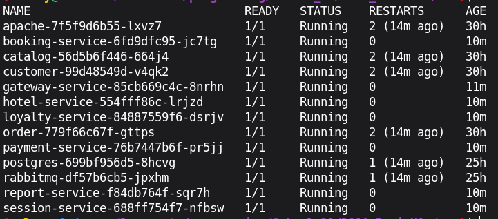
### 2.4 Decoding a secret value
- The Secret stores values base64-encoded. They can be decoded with `kubectl` and `base64 --decode`:
- 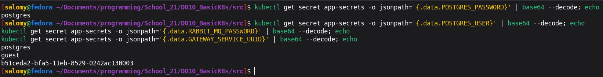
- 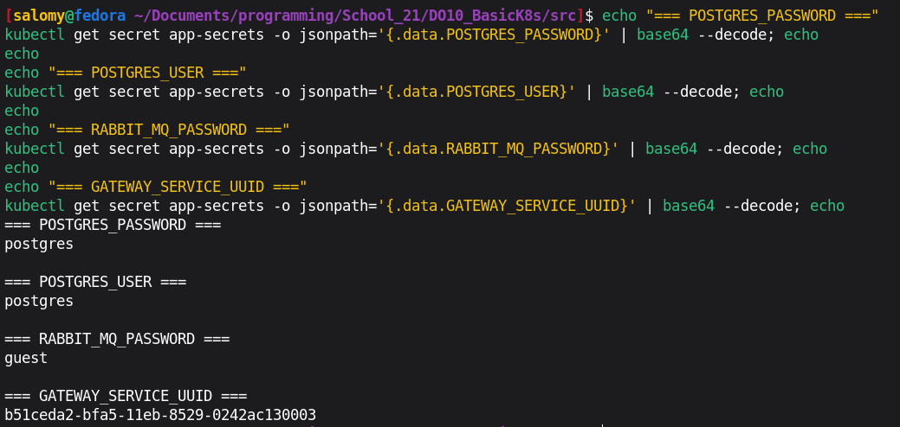

- and this is the logs for hotel-service:
```
2026-04-24 21:14:15.578  INFO 1 --- [           main] com.zaxxer.hikari.HikariDataSource       : HikariPool-1 - Starting...
2026-04-24 21:14:18.522  INFO 1 --- [           main] com.zaxxer.hikari.HikariDataSource       : HikariPool-1 - Start completed.
2026-04-24 21:14:19.104  INFO 1 --- [           main] org.hibernate.dialect.Dialect            : HHH000400: Using dialect: org.hibernate.dialect.PostgreSQL10Dialect
2026-04-24 21:14:26.127  INFO 1 --- [           main] o.h.e.t.j.p.i.JtaPlatformInitiator       : HHH000490: Using JtaPlatform implementation: [org.hibernate.engine.transaction.jta.platform.internal.NoJtaPlatform]
2026-04-24 21:14:26.171  INFO 1 --- [           main] j.LocalContainerEntityManagerFactoryBean : Initialized JPA EntityManagerFactory for persistence unit 'default'
2026-04-24 21:14:34.649  WARN 1 --- [           main] JpaBaseConfiguration$JpaWebConfiguration : spring.jpa.open-in-view is enabled by default. Therefore, database queries may be performed during view rendering. Explicitly configure spring.jpa.open-in-view to disable this warning
2026-04-24 21:14:38.720  INFO 1 --- [           main] .s.s.UserDetailsServiceAutoConfiguration : 

Using generated security password: 52a6cb5e-27e3-43fa-8f94-f9ed6e84fa62

2026-04-24 21:14:41.532  INFO 1 --- [           main] o.s.s.web.DefaultSecurityFilterChain     : Will secure any request with [org.springframework.security.web.context.request.async.WebAsyncManagerIntegrationFilter@210386e0, org.springframework.security.web.context.SecurityContextPersistenceFilter@70e659aa, org.springframework.security.web.header.HeaderWriterFilter@596df867, org.springframework.security.web.authentication.logout.LogoutFilter@1c25b8a7, com.s21.devops.sample.hotelservice.Security.JwtFilter@6676f6a0, org.springframework.security.web.savedrequest.RequestCacheAwareFilter@285f09de, org.springframework.security.web.servletapi.SecurityContextHolderAwareRequestFilter@1827a871, org.springframework.security.web.authentication.AnonymousAuthenticationFilter@3d4d3fe7, org.springframework.security.web.session.SessionManagementFilter@241a53ef, org.springframework.security.web.access.ExceptionTranslationFilter@6c4f9535, org.springframework.security.web.access.intercept.FilterSecurityInterceptor@133e019b]
2026-04-24 21:14:47.889  INFO 1 --- [           main] o.s.s.concurrent.ThreadPoolTaskExecutor  : Initializing ExecutorService 'applicationTaskExecutor'
2026-04-24 21:15:00.663  INFO 1 --- [           main] o.s.b.a.e.web.EndpointLinksResolver      : Exposing 3 endpoint(s) beneath base path '/actuator'
2026-04-24 21:15:01.232  INFO 1 --- [           main] o.s.b.w.embedded.tomcat.TomcatWebServer  : Tomcat started on port(s): 8082 (http) with context path ''
2026-04-24 21:15:01.345  INFO 1 --- [           main] c.s.d.s.h.HotelServiceApplication        : Started HotelServiceApplication in 101.276 seconds (JVM running for 112.173)
```
- and this for gateway-service:
```
2026-04-24 21:13:15.770  INFO 1 --- [           main] c.s.d.s.g.GatewayServiceApplication      : No active profile set, falling back to default profiles: default
2026-04-24 21:13:40.466  INFO 1 --- [           main] o.s.b.w.embedded.tomcat.TomcatWebServer  : Tomcat initialized with port(s): 8087 (http)
2026-04-24 21:13:40.549  INFO 1 --- [           main] o.apache.catalina.core.StandardService   : Starting service [Tomcat]
2026-04-24 21:13:40.550  INFO 1 --- [           main] org.apache.catalina.core.StandardEngine  : Starting Servlet engine: [Apache Tomcat/9.0.43]
2026-04-24 21:13:40.823  INFO 1 --- [           main] o.a.c.c.C.[Tomcat].[localhost].[/]       : Initializing Spring embedded WebApplicationContext
2026-04-24 21:13:40.824  INFO 1 --- [           main] w.s.c.ServletWebServerApplicationContext : Root WebApplicationContext: initialization completed in 21064 ms
2026-04-24 21:13:46.972  INFO 1 --- [           main] .s.s.UserDetailsServiceAutoConfiguration : 

Using generated security password: 8a05693d-6b6d-479b-bbd8-b036d3b27fcc

2026-04-24 21:13:53.865  INFO 1 --- [           main] o.s.b.a.e.web.EndpointLinksResolver      : Exposing 3 endpoint(s) beneath base path '/actuator'
2026-04-24 21:13:54.026  INFO 1 --- [           main] o.s.s.web.DefaultSecurityFilterChain     : Will secure any request with [org.springframework.security.web.context.request.async.WebAsyncManagerIntegrationFilter@33f676f6, org.springframework.security.web.context.SecurityContextPersistenceFilter@1750fbeb, org.springframework.security.web.header.HeaderWriterFilter@cecf639, org.springframework.web.filter.CorsFilter@4c5ae43b, org.springframework.security.web.authentication.logout.LogoutFilter@7c137fd5, com.s21.devops.sample.gatewayservice.Security.JwtFilter@5e600dd5, org.springframework.security.web.savedrequest.RequestCacheAwareFilter@268f106e, org.springframework.security.web.servletapi.SecurityContextHolderAwareRequestFilter@6c284af, org.springframework.security.web.authentication.AnonymousAuthenticationFilter@264f218, org.springframework.security.web.session.SessionManagementFilter@7ce026d3, org.springframework.security.web.access.ExceptionTranslationFilter@5386659f, org.springframework.security.web.access.intercept.FilterSecurityInterceptor@3cce57c7]
2026-04-24 21:13:54.276  INFO 1 --- [           main] o.s.s.concurrent.ThreadPoolTaskExecutor  : Initializing ExecutorService 'applicationTaskExecutor'
2026-04-24 21:13:55.575  INFO 1 --- [           main] o.s.b.w.embedded.tomcat.TomcatWebServer  : Tomcat started on port(s): 8087 (http) with context path ''
2026-04-24 21:13:56.541  INFO 1 --- [           main] c.s.d.s.g.GatewayServiceApplication      : Started GatewayServiceApplication in 54.404 seconds (JVM running for 66.602)
```
- And for session-service:
```
2026-04-24 21:14:05.841  WARN 1 --- [           main] JpaBaseConfiguration$JpaWebConfiguration : spring.jpa.open-in-view is enabled by default. Therefore, database queries may be performed during view rendering. Explicitly configure spring.jpa.open-in-view to disable this warning
2026-04-24 21:14:13.216  INFO 1 --- [           main] o.hibernate.jpa.internal.util.LogHelper  : HHH000204: Processing PersistenceUnitInfo [name: default]
2026-04-24 21:14:14.692  INFO 1 --- [           main] org.hibernate.Version                    : HHH000412: Hibernate ORM core version 5.4.30.Final
2026-04-24 21:14:16.713  INFO 1 --- [           main] o.hibernate.annotations.common.Version   : HCANN000001: Hibernate Commons Annotations {5.1.2.Final}
2026-04-24 21:14:17.702  INFO 1 --- [           main] com.zaxxer.hikari.HikariDataSource       : HikariPool-1 - Starting...
2026-04-24 21:14:19.458  INFO 1 --- [           main] com.zaxxer.hikari.HikariDataSource       : HikariPool-1 - Start completed.
2026-04-24 21:14:19.884  INFO 1 --- [           main] org.hibernate.dialect.Dialect            : HHH000400: Using dialect: org.hibernate.dialect.PostgreSQL10Dialect
2026-04-24 21:14:25.885  WARN 1 --- [           main] o.h.engine.jdbc.spi.SqlExceptionHelper   : SQL Warning Code: 0, SQLState: 00000
2026-04-24 21:14:25.891  WARN 1 --- [           main] o.h.engine.jdbc.spi.SqlExceptionHelper   : relation "users" does not exist, skipping
2026-04-24 21:14:25.897  WARN 1 --- [           main] o.h.engine.jdbc.spi.SqlExceptionHelper   : SQL Warning Code: 0, SQLState: 00000
2026-04-24 21:14:25.897  WARN 1 --- [           main] o.h.engine.jdbc.spi.SqlExceptionHelper   : table "roles" does not exist, skipping
2026-04-24 21:14:25.903  WARN 1 --- [           main] o.h.engine.jdbc.spi.SqlExceptionHelper   : SQL Warning Code: 0, SQLState: 00000
2026-04-24 21:14:25.906  WARN 1 --- [           main] o.h.engine.jdbc.spi.SqlExceptionHelper   : table "users" does not exist, skipping
2026-04-24 21:14:26.616  INFO 1 --- [           main] o.h.e.t.j.p.i.JtaPlatformInitiator       : HHH000490: Using JtaPlatform implementation: [org.hibernate.engine.transaction.jta.platform.internal.NoJtaPlatform]
2026-04-24 21:14:26.673  INFO 1 --- [           main] j.LocalContainerEntityManagerFactoryBean : Initialized JPA EntityManagerFactory for persistence unit 'default'
2026-04-24 21:14:48.359  INFO 1 --- [           main] o.s.s.web.DefaultSecurityFilterChain     : Will secure any request with [org.springframework.security.web.context.request.async.WebAsyncManagerIntegrationFilter@26b894bd, org.springframework.security.web.context.SecurityContextPersistenceFilter@486be205, org.springframework.security.web.header.HeaderWriterFilter@5aa0dbf4, org.springframework.security.web.authentication.logout.LogoutFilter@3174cb09, com.s21.devops.sample.sessionservice.Security.JwtFilter@740abb5, org.springframework.security.web.savedrequest.RequestCacheAwareFilter@74f7d1d2, org.springframework.security.web.servletapi.SecurityContextHolderAwareRequestFilter@5a62b2a4, org.springframework.security.web.authentication.AnonymousAuthenticationFilter@287f94b1, org.springframework.security.web.session.SessionManagementFilter@2c5d601e, org.springframework.security.web.access.ExceptionTranslationFilter@5400db36, org.springframework.security.web.access.intercept.FilterSecurityInterceptor@41394595]
2026-04-24 21:14:55.834  INFO 1 --- [           main] o.s.s.concurrent.ThreadPoolTaskExecutor  : Initializing ExecutorService 'applicationTaskExecutor'
2026-04-24 21:15:04.593  INFO 1 --- [           main] o.s.b.a.e.web.EndpointLinksResolver      : Exposing 3 endpoint(s) beneath base path '/actuator'
2026-04-24 21:15:05.795  INFO 1 --- [           main] o.s.b.w.embedded.tomcat.TomcatWebServer  : Tomcat started on port(s): 8081 (http) with context path ''
2026-04-24 21:15:05.851  INFO 1 --- [           main] c.s.d.s.s.SessionServiceApplication      : Started SessionServiceApplication in 108.23 seconds (JVM running for 117.266)
```
### Tunnel URLs:
- Gateway: `http://192.168.49.2:30737`
- Session: `http://192.168.49.2:30088`
- 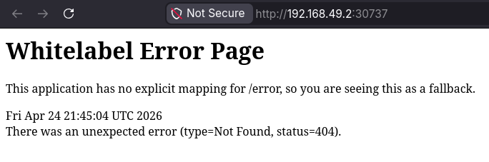
- 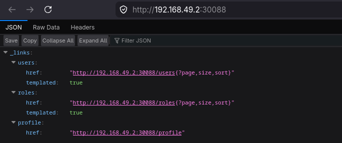

- and this is the postman test result:
- 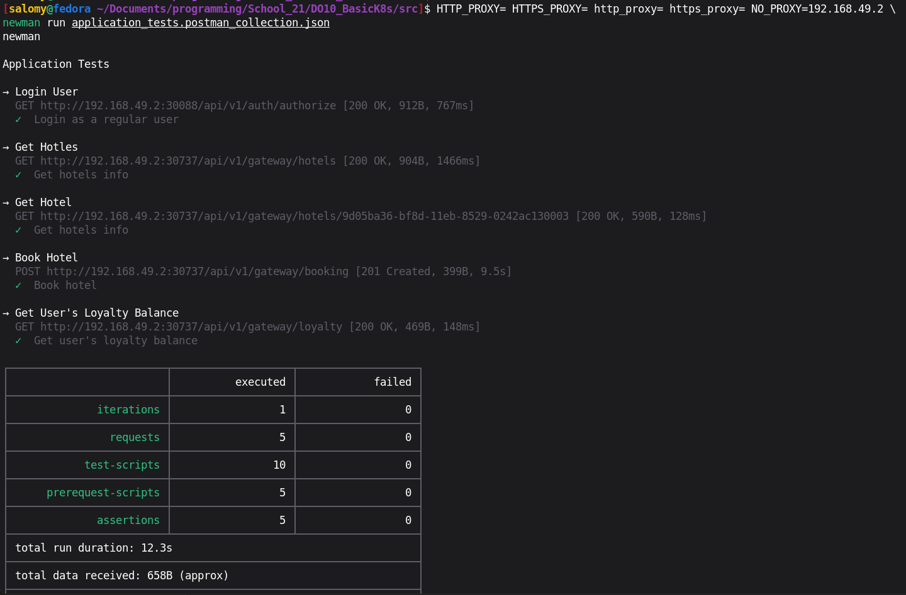

- When we return to the dashboard we will see:
- 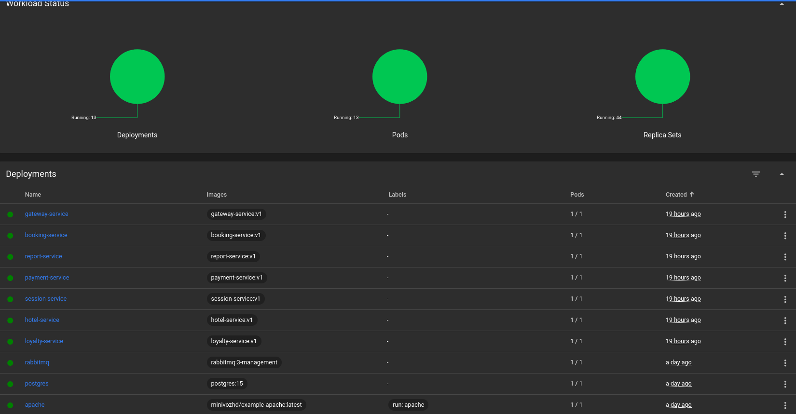
- 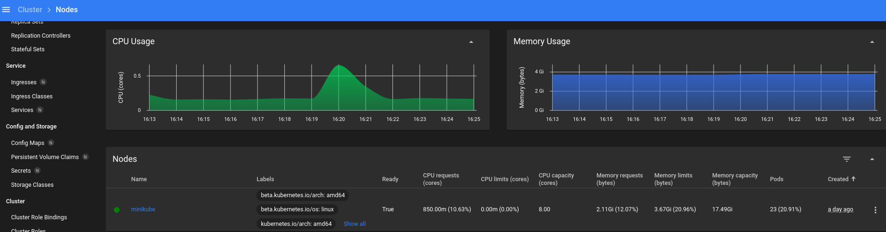
- 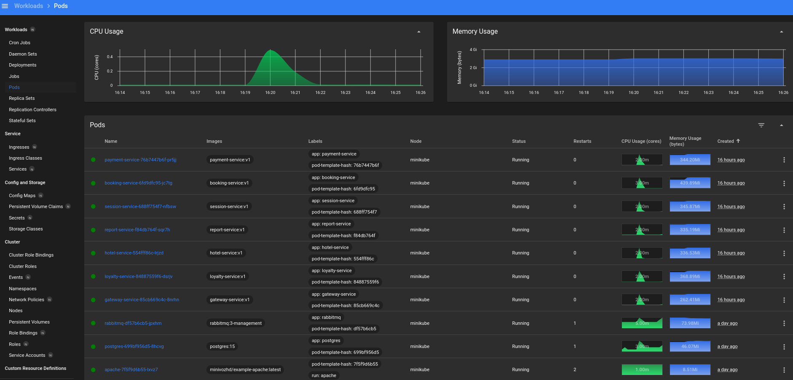
- 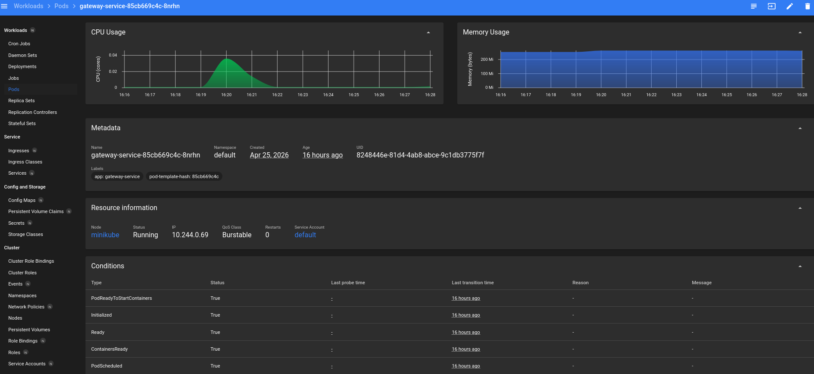
- 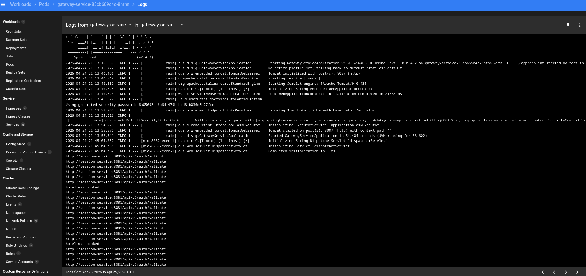
- 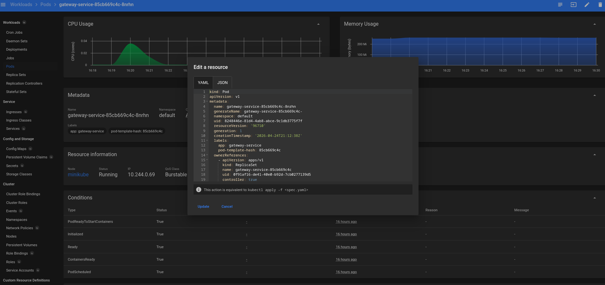
- 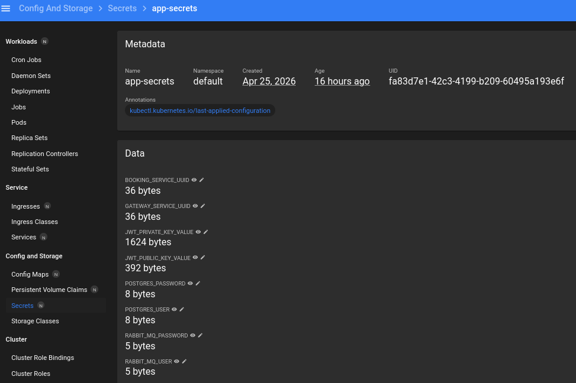
- 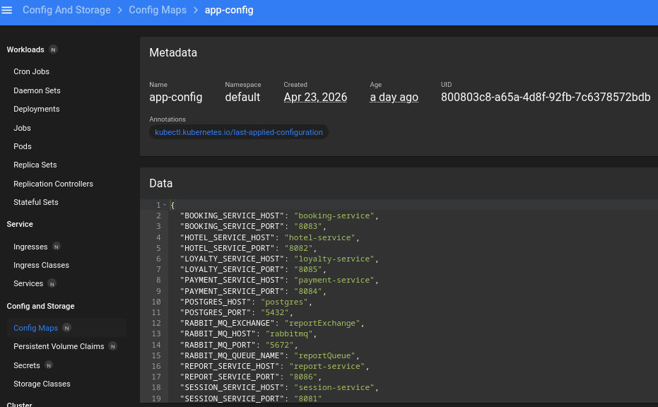

- I added to hotal pom.xml this part 
```
<dependency>
  <groupId>org.apache.commons</groupId>
  <artifactId>commons-lang3</artifactId>
  <version>3.14.0</version>
</dependency>
```
- After that I build the image again with tag v2 using this command `docker build -t hotel-service:v2 ./hotel-service`
- Then I patch it: `kubectl patch deployment hotel-service -p '{"spec":{"strategy":{"type":"Recreate","rollingUpdate":null}}}'`
- Next I measure the time with command `time (kubectl set image deployment/hotel-service hotel-service=hotel-service:v2 && kubectl rollout status deployment/hotel-service)`:
- 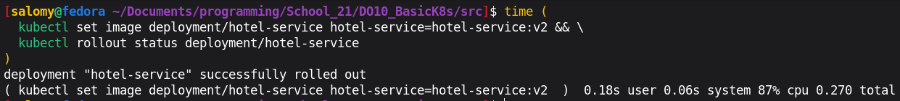
- 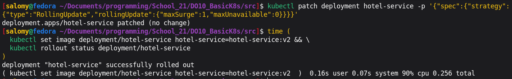
